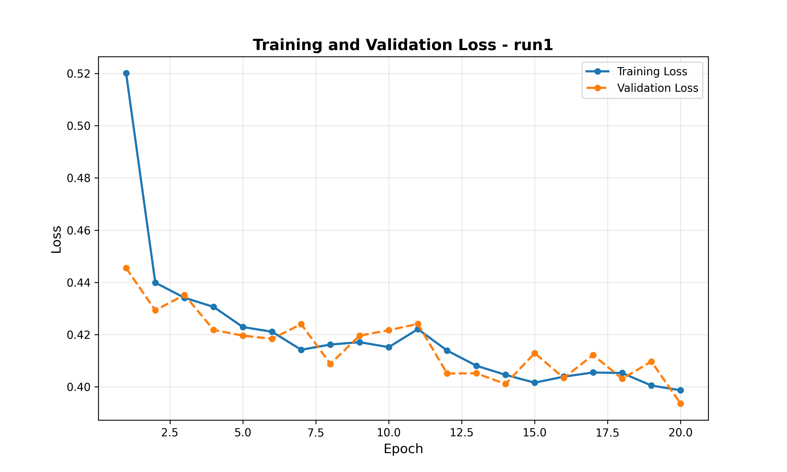

dataloader.py was written by Gemini 3 Flash, training plots by Claude 4.5 Opus. 

A small transformer model taking SMILES strings as input and HOMO-LUMO gap as output from the QM9 dataset, designed for future interpretability project.

Project log

26 Dec - created dataloader, implemented transformer architecture

27 Dec - completed training run on HOMO-LUMO gaps

01 Feb - Tested a [VDD](https://gist.github.com/dollspace-gay/45c95ebfb5a3a3bae84d8bebd662cc25)-like mechanistic interpretability setup with adversarially prompted Gemini 3 Flash experimentalist and Claude 4.5 Opus theorist. Among other results, they found "[a] strong positional bias for ring membership was observed, suggesting a dataset artifact where ring structures appear more frequently in early SMILES positions." I hope to verify their other findings soon.
